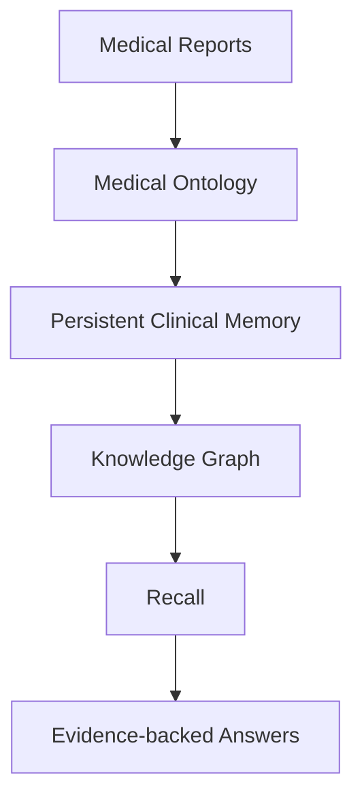
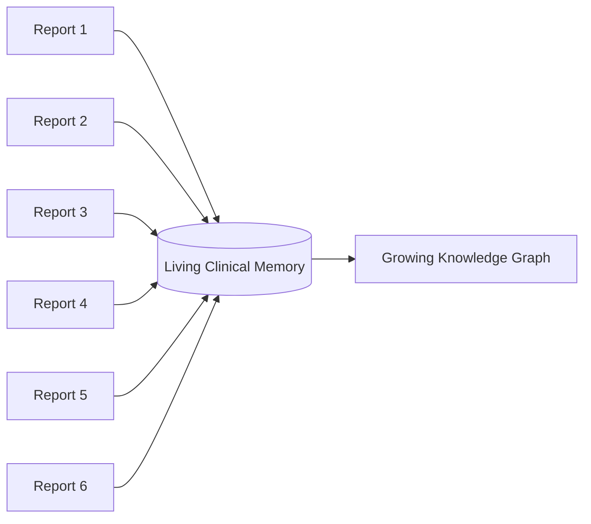
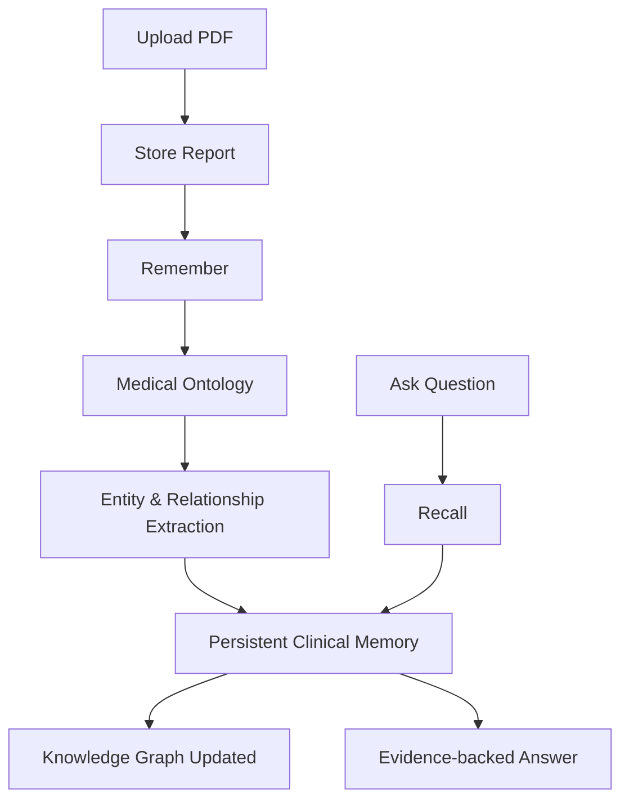
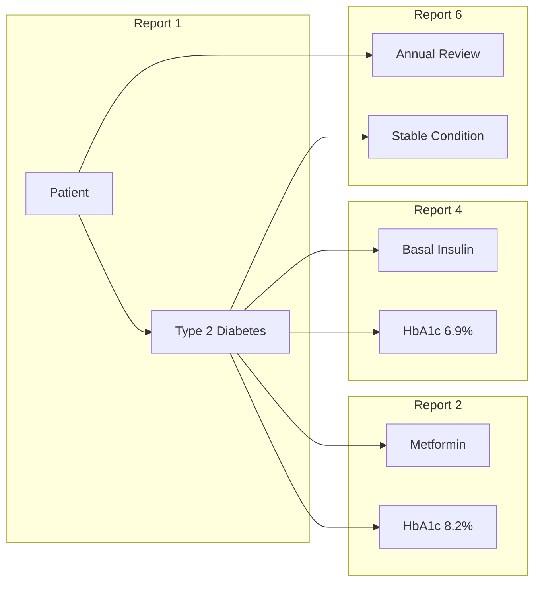
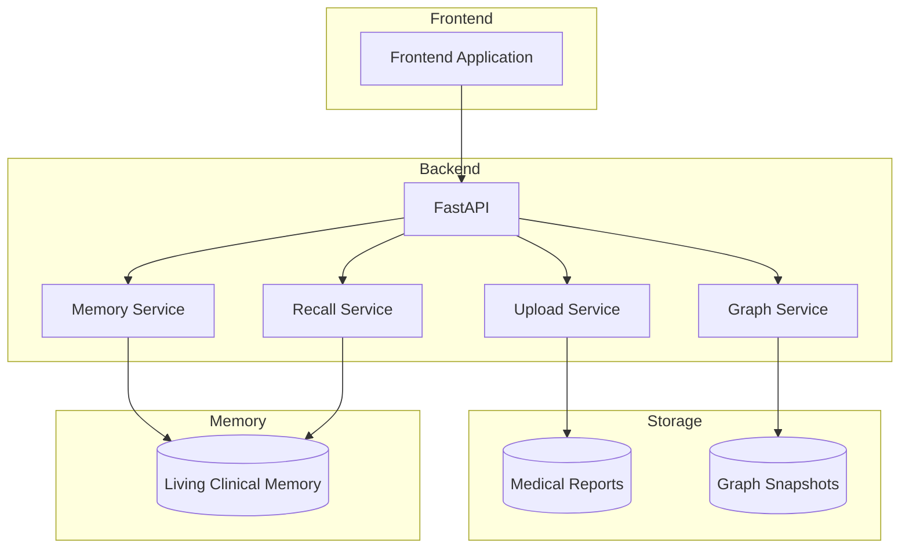

# Living Record

> **Transforming isolated medical reports into a living clinical record.**

Healthcare is a continuous journey, yet most AI systems treat medical reports as isolated documents. **Living Record** builds an evolving clinical memory where every new report enriches the patient's history instead of becoming another disconnected file.

Built as a hackathon project to demonstrate how persistent memory can improve longitudinal understanding of patient health.

---

## Why Living Record?

Traditional document-based AI systems answer questions by searching uploaded documents every time.

Living Record takes a different approach.

Instead of repeatedly searching documents, it **remembers**.

Every uploaded report becomes part of an evolving clinical memory that understands:

* Disease progression
* Medication history
* Laboratory trends
* Clinical observations
* Treatment evolution
* Relationships between medical events

---

## The Problem

Healthcare information is fragmented.

```
Report 1
Report 2
Report 3
Report 4
Report 5
Report 6
```

Each report contains only a snapshot of the patient's condition.

Understanding the complete story requires connecting information across months or years.

Most AI systems retrieve document chunks.

They **do not build memory**.

---

## Our Solution

Living Record converts medical reports into an evolving knowledge graph that acts as a persistent clinical memory.



---

## Core Memory Formation

Every uploaded report becomes another memory.



Instead of creating isolated embeddings, every report enriches the existing patient memory.

---

## Behind the Scenes



---

## Memory Evolution

As new reports arrive, memory evolves instead of restarting.



The graph continuously becomes richer as more clinical information is remembered.

---

## Example Questions

* How has John's diabetes progressed?
* When was insulin introduced?
* Show all HbA1c values over time.
* Which medications are currently active?
* Summarize the patient's clinical journey.
* What changed since the first visit?

---

## System Architecture



---

## 📂 Repository Structure

```text
living-record/

├── backend/
│   ├── api/
│   ├── services/
│   ├── storage/
│   └── main.py
│
├── frontend/
│
├── ontology/
│   └── medical_memory_ontology.owl
│
├── reports/
│   ├── John_Doe_01.pdf
│   ├── ...
│
├── graphs/
│
└── README.md
```

---

## Features

* 📄 Medical report ingestion
* 🧠 Persistent clinical memory
* 🩺 Medical ontology
* 🕸️ Knowledge graph generation
* 📈 Longitudinal patient timeline
* 🔍 Evidence-backed recall
* 📚 Incremental memory growth
* 🔗 Semantic relationships

---

## Vision

Healthcare is not a collection of documents.

It is a continuously evolving story.

**Living Record** transforms isolated medical reports into a living clinical record that grows with every patient encounter, enabling contextual, explainable, and longitudinal understanding of patient care.
